# Proyecto A: Sistema RAG Educativo 
Proyecto realizado por Esther Maroto Torres

---

## 📋 Descripción del Proyecto

Sistema inteligente de Retrieval-Augmented Generation (RAG) diseñado para vectorizar y procesar documentos educativos (PDF/TXT/DOC/DOCX), permitiendo responder preguntas basadas exclusivamente en el conocimiento extraído de esos archivos. El sistema garantiza respuestas contextuales y precisas mediante búsqueda vectorial avanzada.

## 🏗️ Stack Tecnológico

- **n8n**: Orquestación y automatización de workflows RAG
- **Ollama**: Modelos de lenguaje de Jarvis para embeddings y generación de respuestas
- **Qdrant**: Base de datos vectorial para búsqueda semántica de documentos
- **PostgreSQL**: Almacenamiento de metadatos 

## 🔄 Estructura del Workflow RAG

### 1. **Ingesta de Documentos**

```
Documento → Chunks → Embeddings → Qdrant + Metadata en PostgreSQL → Mensaje de confirmación
```

- Lectura de documentos (PDF/TXT/DOC/DOCX)
- División en chunks procesables
- Generación de embeddings vectoriales
- Almacenamiento simultáneo en Qdrant y PostgreSQL

### 2. **Procesamiento de Consultas**

```
Pregunta → Búsqueda Vectorial → Contexto Relevante → Respuesta LLM
```

- Vectorización de la pregunta del usuario
- Búsqueda semántica en Qdrant
- Recuperación de contexto relevante
- Generación de respuesta mediante LLM

## 📊 Esquema SQL

```sql

CREATE TABLE documentos (
 id SERIAL PRIMARY KEY,
 nombre VARCHAR(255),
 num_chunks INTEGER,
 fecha_procesado TIMESTAMP DEFAULT NOW()
);
```


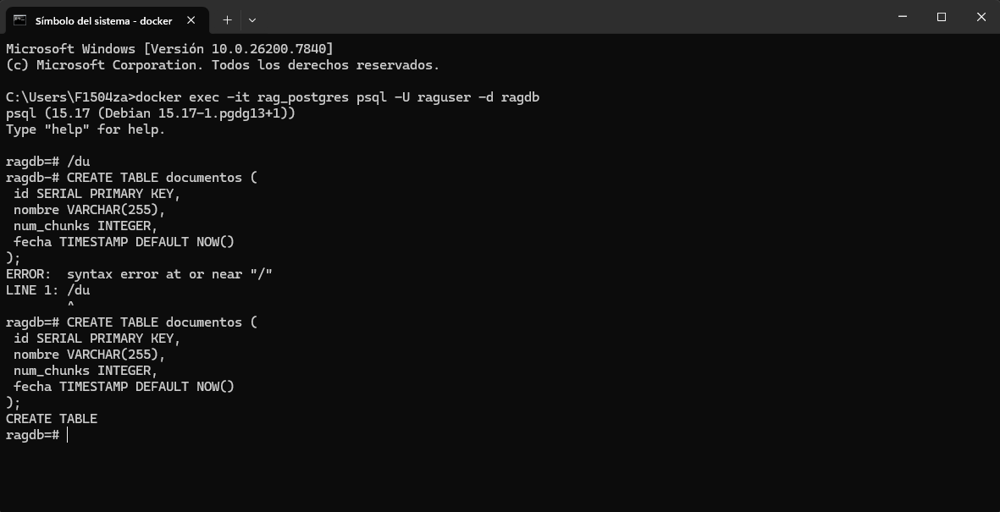

> Creo la tabla según las recomendaciones de moodle
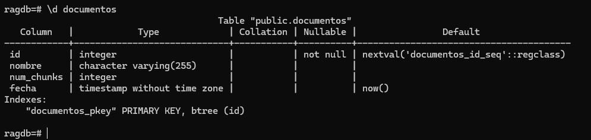


---

## 🔗 Explicación del workflow

Al contrario de las recomendaciones de Moodle he decidido realizar el proceso de ingesta y de búsqueda dentro de un mismo workflow. 
Además al no tener un ordenador que soporte bien los modelos de ollama, aún habiendo añadido el contenedor de ollama al contenedor del proyecto hemos decidido utilizar los modelos de Jarvis para que el proyecto funcionara correctamente.

He utilizado el modelo `qwen2.5:7b-instruct` para el flujo de las consultas.

Para los embeddings he utilizado el modelo `nomic-embed-text` que también está conectado al vector retriever del flujo de búsqueda. 

**¿Por qué estos modelos?**

El modelo `nomic-embed-text` es el que mejor funciona a la hora de hacer los embeddings y ya lo hemos utilizado en otras ocasiones.

El modelo `qwen2.5:7b-instruct` es fácil de limitar y soporta tools como es *Qdrant Vector Store* que es necesario para el proceso de búsqueda, también probé con los modelos `llama3.2`, `llama3` y `mistral`, pero los modelos de llama no soportan los tools de los agentes y mistral me daba problemas a la hora de mandar la petición al tool y daba error. 

### Explicación por nodos

#### Ingesta de documentos

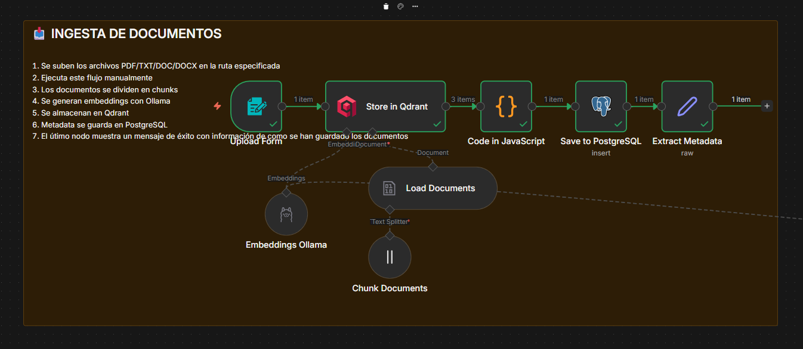

- **Upload Form**: está configurado para aceptar archivos `.pdf, .txt, .doc, .docx`. 
Al ejecutarse el flujo salta una tab con esta url `http://localhost:5679/webhook-test/upload-document/n8n-form` donde podemos subir los archivos que deseemos para la ingesta.

- **Store in Qdrant**: con la credencial de nuestro contenedor de qdrant, seleccionamos el *operation mode* como `Insert Documents` y desde la lista que habrá cargado de nuestras *collections* seleccionamos (en mi caso) `educational_docs` y marcamos el *Embedding batch size* con 100. Guarda los vectores en la collection

    - <u>Embeddings Ollama</u>: convierte cada fragmento de texto en un vector numérico.
    - <u>Load Documents</u>: carga el documento y lo convierte en texto.
    - <u>Chunk Documents</u>: divide el documento en *chunks* (trozos pequeños), en nuestro caso los chunks son de 500 palabras.

- **Code in JavaScript**: extrae los datos necesarios para pasarle al nodo de postgres.
```javascript
return [
 {
  json: {
   nombre: $items()[0].json.metadata.source,
   num_chunks: $items().length
  }
 }
];
```
- **Save to PostgreSQL**: con la tabla indicada `documentos` mapea los campos que han de ser rellenados y podemos pasar los datos extraídos del nodo anterior, para guardarlos en la tabla.

- **Extract Metadata**: muestra en los logs un mensaje de confirmación de que se ha realizado bien el proceso y devuelve la siguiente información: 

```json
{
 "status": "success",
 "mensaje": "Documento vectorizado correctamente",
 "documento": "{{$json.nombre}}",   <--- el nombre del propio documento subido
 "chunks": "{{$json.num_chunks}}",  <--- el número de chunks que se han generado 
 "vector_store": "Qdrant",
 "embeddings": "Ollama"
} 
```

### Resultado final 
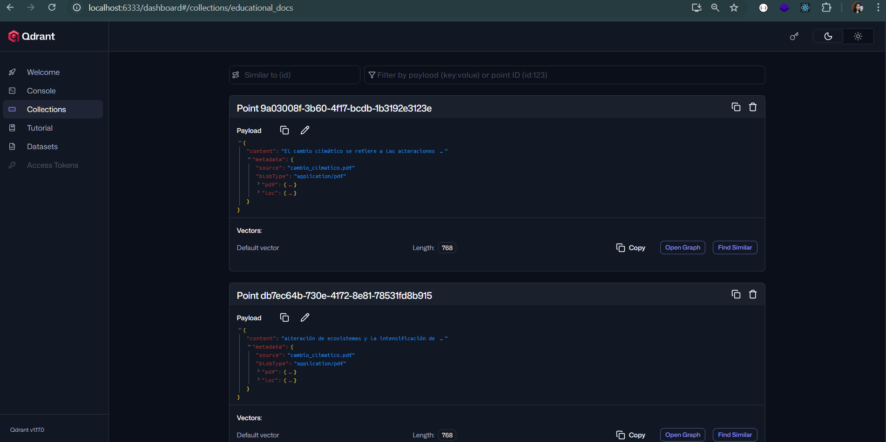
<br>

#### Consulta RAG

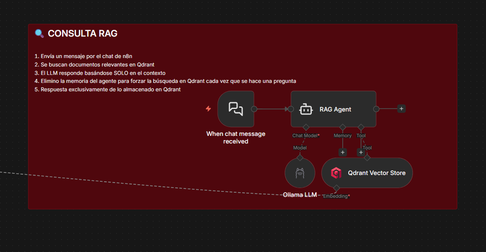

- **When chat message received**: se activa cuando se escribe un mensaje por el chat de n8n.

- **RAG Agent**: recibe el mensaje del usuario y aplica el prompt que tiene. 

    - <u>Ollama LLM</u>: proporciona el modelo para que funcione el agente.
    - <u>Qdrant Vector Store</u>: busca los chunks más parecidos a la pregunta.
    Ejemplo:

            Pregunta:

            ¿Qué es la fotosíntesis?

            Encuentra:

            Chunk 1: explicación de fotosíntesis
            Chunk 2: proceso en plantas
            Chunk 3: clorofila

         Recupera el contexto relevante.
Está conectado al mismo modelo de embeddings que el flujo de la ingesta para que los vectores coincidan.

> El agente no consta de memoria del chat para obligarlo a buscar cada pregunta en la colección y no recupere respuestas de la memoria que puedan ser erróneas, de esta forma también se limita mucho más el que el modelo divague con la información que devuelve.

### Muestras de interacción con el agente

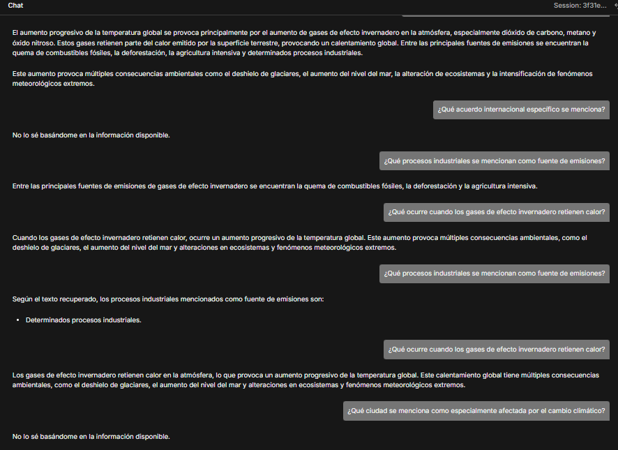

Tiene especificado en el prompt que debe responder en caso de no encontrar coincidencia con la pregunta hecha y que no debe *inventar* en caso de no encontrar respuesta o de devolver información no añadir nada más.

---

### Dificultades encontradas

La principal dificultad de este proyecto han sido los fallos con los modelos hasta que he dado con el que funcionaba correctamente para los requisitos que le estaba pidiendo, dependiendo del modelo daba un error diferente por lo tanto era bastante frustrante.

También a la hora de hacer el prompt he tenido que ir añadiendo bastantes detalles hasta que he conseguido un prompt que limita lo que necesito y al que el modelo puede ceñirse al pie de la letra.

La decisión de eliminar también la memoria de chat ha venido de un problema con el agente, al cargar "una vez" los chunks con la primera pregunta, dejaba de entrar en el tool de qdrant por lo que empezaba a divagar y a inventar información. Al eliminar la memoria, el agente no "retiene" por lo que siempre se ve obligado a acudir a la colección y no da información inventada.


# Proyecto B: ChatBot Multiherramienta con Registro en Base de Datos 
Proyecto realizado por Rita Vicente Domínguez

---

## 📋 Descripción del Proyecto
Desarrollo de un asistente virtual avanzado capaz de discernir la intención del usuario entre cuatro categorías (clima, país, wikipedia, general). El sistema no solo responde de forma humana, sino que consulta fuentes de datos externas en tiempo real y mantiene un registro histórico detallado de todas las interacciones en una base de datos PostgreSQL.

## 🏗️ Stack Tecnológico
- **n8n**: Orquestador del flujo y lógica de bifurcación (Switch).
- **Ollama(Mistral)**: Modelo de IA mistral:instruct a través de la utilización de Jarvis para clasificar y generar respuestas más naturales (Por restricciones técnicas de mi equipo ha sido inviable usar una IA local)
- **PostgreSQL**: Base de datos relacional para el registro de auditoría (chatbot_db)
- **APIs Externas**: 
    - OpenWaeather: Datos meteorológicos
    - RestCountries: Información geopolítica. 
    - Wikipedia: Definiciones y cultura general.

## Estructura del Workflow 
El flujo sigue una estructura lineal de preparación que luego se bifurca en ramas especializadas:
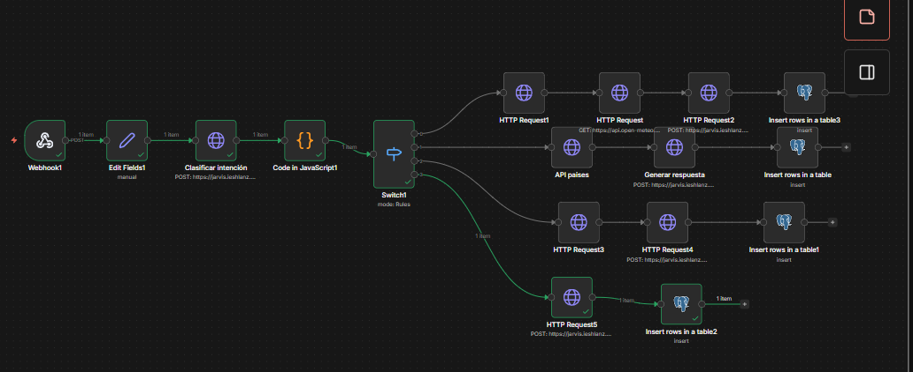

 * **Webhook1**: Es el punto de entrada. Recibe las peticiones externas (mensajes del usuario) a través de un PowerShell con el siguiente comando: 
`Invoke-RestMethod -Method Post -Uri "http://localhost:5678/webhook-test/chatbot" -ContentType "application/json" -Body '{"usuario_id":"u1","pregunta":"Hola, como estas?"}'` 
Invoke-RestMethod: Es el "verbo" principal. Le dice a PowerShell que haga una petición HTTP a una API o servicio web y que procese la respuesta automáticamente.
-Method Post: Indica que vas a enviar o "postear" datos al servidor (en lugar de solo pedirlos).
-Uri "http://localhost:5678/webhook-test/chatbot": Es la dirección a donde va la información. En este caso, apunta a mi ordenador (localhost) en el puerto 5678
-ContentType "application/json": Le avisa al servidor que la información que le estás mandando está en formato JSON, que es el lenguaje estándar para las APIs modernas.
-Body '{"usuario_id":"u1","pregunta":"Hola, como estas?"}': Este es el contenido real del mensaje. Estás enviando un "paquete" con el ID del usuario y el texto de la pregunta.

* **Edit Fields1**: Aquí se normalizan los datos. Se definen manualmente las variables base como pregunta y usuario_id para que el resto del flujo pueda trabajar con ellas.
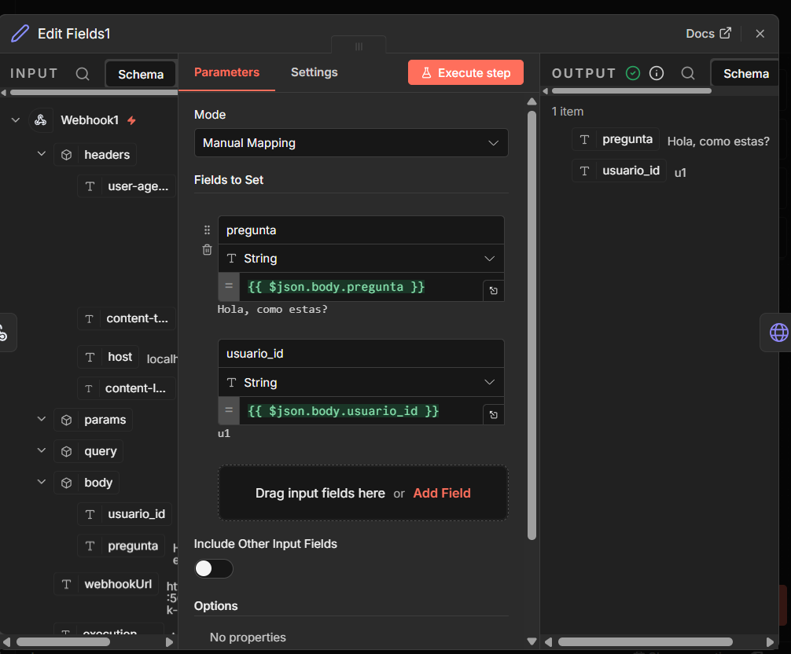

* **Clasificar intención(HTTP Request)**: Aquí reside el "Cerebro". Se envía la pregunta a Mistral con un prompt específico para que determine si la consulta es sobre clima, pais, wikipedia o general.
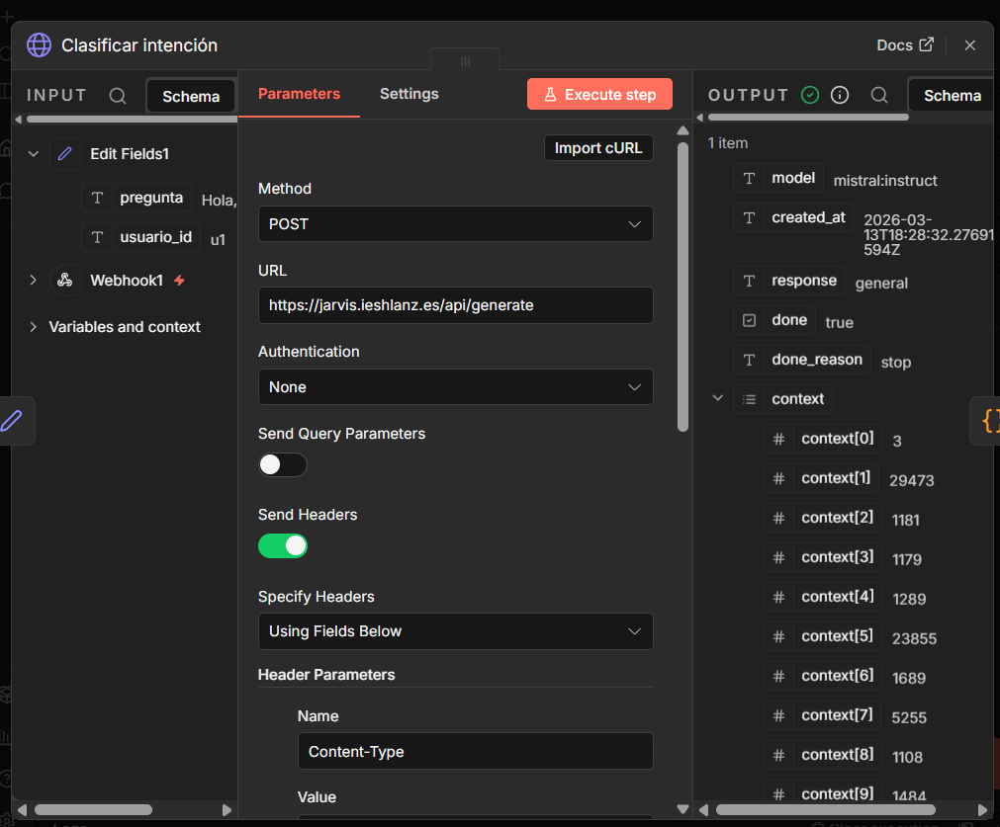
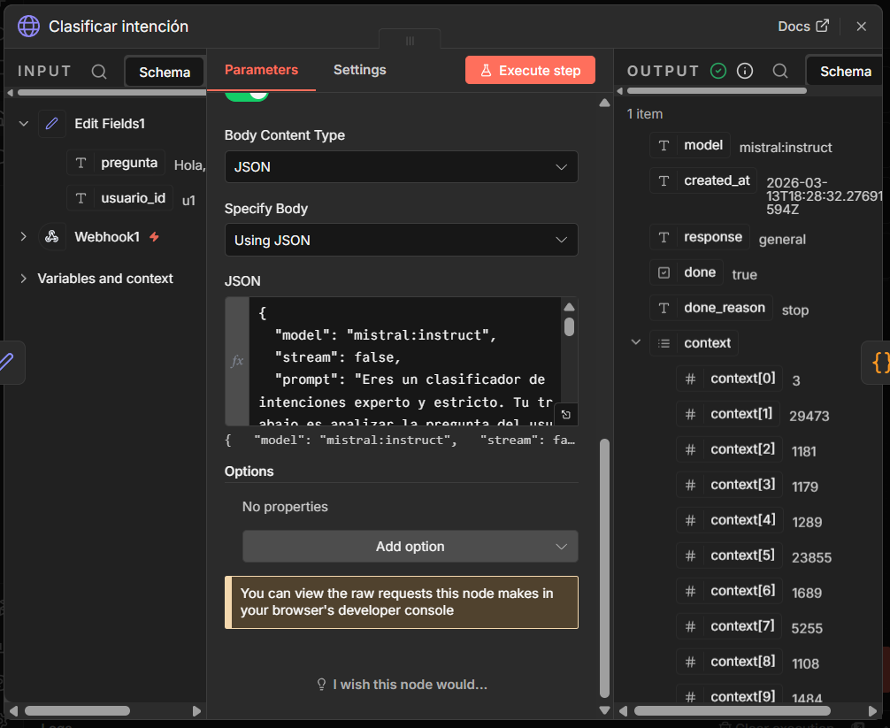

```json
{
    "model": "mistral:instruct",
    "stream": false,
    "prompt": "Eres un clasificador de intenciones experto y estricto. Tu trabajo es analizar la pregunta del usuario y responder ÚNICAMENTE con una de estas cuatro categorías en minúsculas: clima, pais, wikipedia, general.\n\nReglas de clasificación:\n1. clima: Si mencionan temperatura, tiempo atmosférico, lluvia o sol.\n2. pais: Si preguntan por capitales, banderas, población, moneda o datos específicos de una nación.\n3. wikipedia: Si piden una definición, historia de algo, o preguntan '¿Qué es...?' o '¿Quién fue...?' sobre temas culturales o científicos.\n4. general: Saludos, despedidas, agradecimientos o frases que no encajen en las anteriores.\n\nEjemplos:\n- '¿Qué hora es en París?' -> general\n- '¿Qué tiempo hace en Madrid?' -> clima\n- '¿Cuál es la capital de Japón?' -> pais\n- '¿Quién inventó la bombilla?' -> wikipedia\n- 'Hola, ¿cómo estás?' -> general\n\nPregunta del usuario: \"{{ $json.pregunta }}\"\n\nRespuesta (SOLO la palabra):"
}
```

* **Code In JavaScript1**: Este nodo actúa como filtro. Limpia la respuesta de la IA (quita espacios, puntos o mayúsculas) para asegurar que el siguiente nodo (Switch) no cometa errores de lectura.
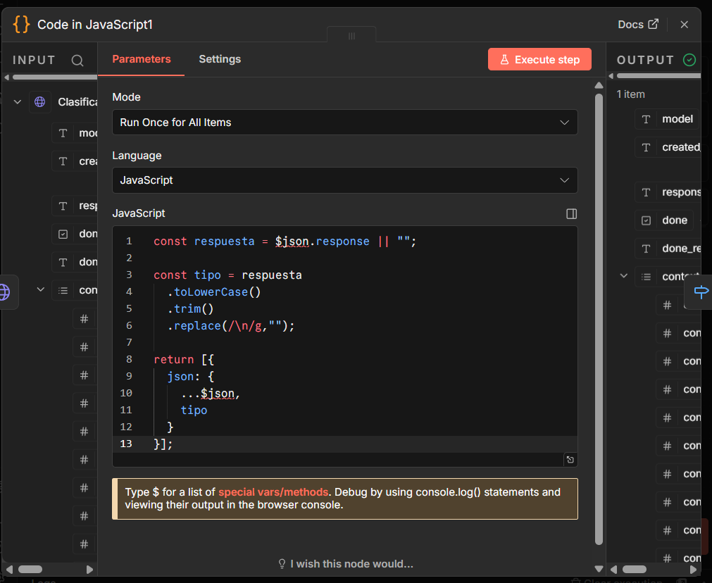

- Codigo: 
const respuesta = $json.response || "";
```javascript
const tipo = respuesta
    .toLowerCase()
    .trim()
    .replace(/\n/g, "");

return [{
    json: {
        ...$json,
        tipo
    }
}];
```

* **El enrutador (Swithc1)**: El nodo Switch1 recibe la categoría clasificada y, según las reglas configuradas, abre una de las cuatro ramas disponibles. Es el corazón lógico que decide qué herramientas usar: 


* **Ramas de Ejecución (Las Herramientas)**

| Rama | Nodos de Proceso | APIs / Servicios usados | Función en el flujo |
|-----|------------------|-------------------------|--------------------|
| Clima | HTTP Request1 → HTTP Request (Weather API) → HTTP Request2 → Insert rows in a table3 | Weather API | Obtiene primero las coordenadas de una ciudad y posteriormente consulta la meteorología actual. Finalmente registra la consulta y la respuesta en la base de datos. |
| Países | API Paises → Generar respuesta → Insert rows in a table | RestCountries API | Consulta información de un país (capital, población, región, etc.), genera una respuesta estructurada para el usuario y guarda el resultado en la base de datos. |
| Wikipedia | HTTP Request3 → HTTP Request4 → Insert rows in a table1 | Wikipedia API | Realiza una búsqueda de un concepto o biografía en Wikipedia, obtiene un resumen del contenido y almacena la respuesta en la base de datos para registro. |
| General | HTTP Request5 → Insert rows in a table2 | Mistral API | Gestiona preguntas generales, saludos o dudas que no requieren APIs externas específicas y guarda la interacción en la base de datos. |
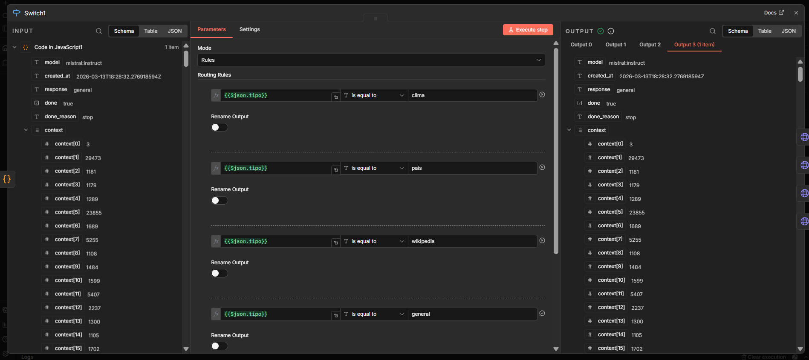
- Tiempo: 
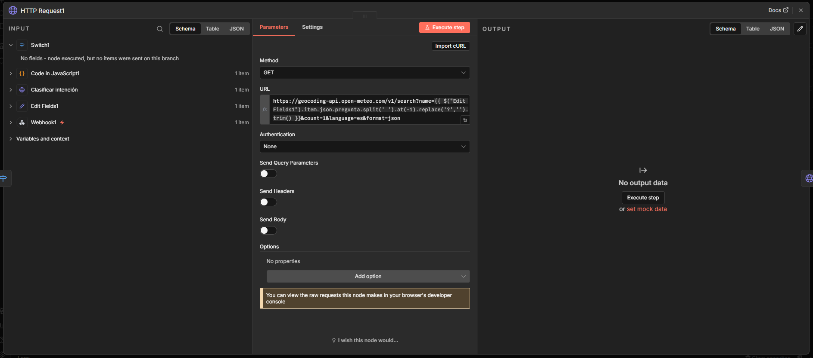
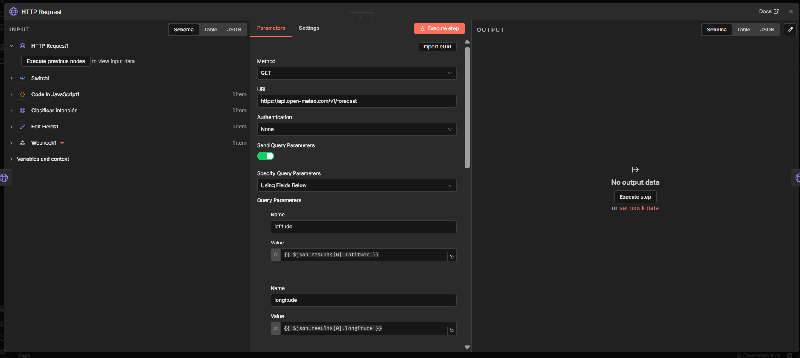
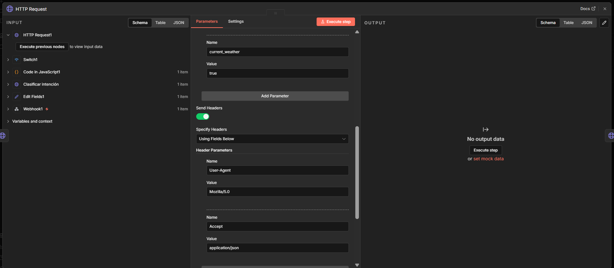
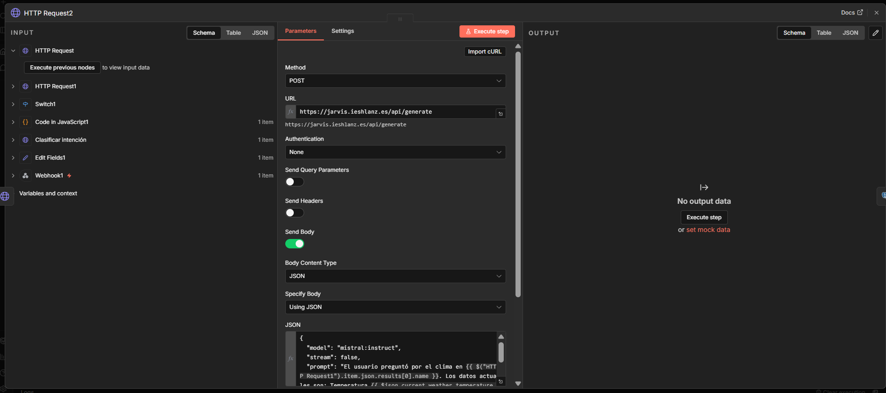

- Prompt Clima: 
```json
{
    "model": "mistral:instruct",
    "stream": false,
    "prompt": "El usuario preguntó por el clima en {{ $("HTTP Request1").item.json.results[0].name }}. Los datos actuales son: Temperatura {{ $json.current_weather.temperature }}°C y velocidad del viento {{ $json.current_weather.windspeed }} km/h. Responde de forma muy amable y humana."
}
```
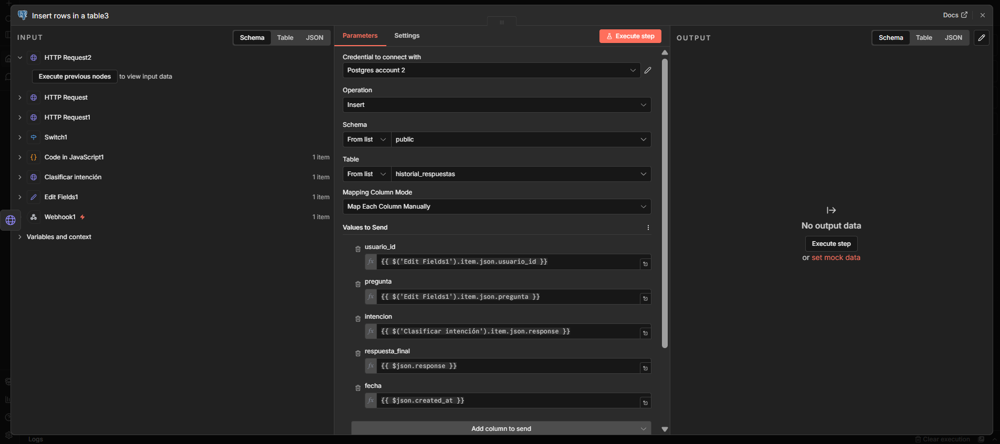

- Pais: 
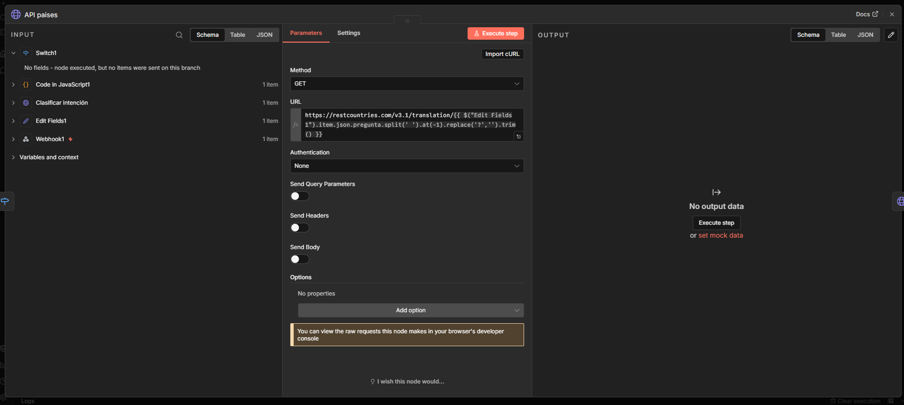
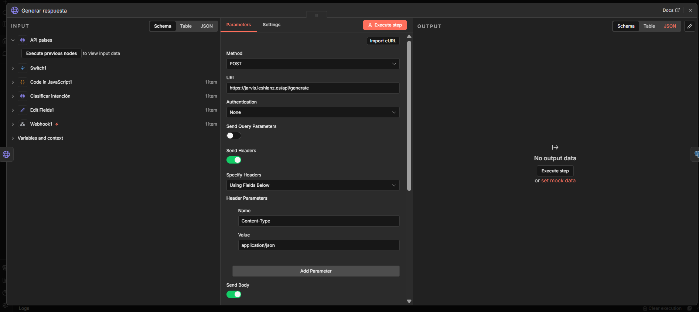
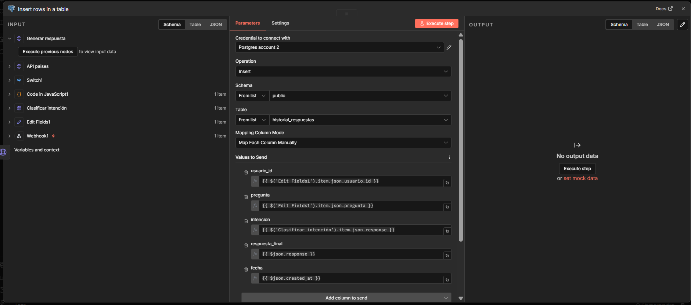

- Prompt Pais
```javascript
{
    "model": "mistral:instruct",
    "stream": false,
    "prompt": "Eres un asistente inteligente. El usuario preguntó: '{{ $("Edit Fields1").item.json.pregunta }}'. La base de datos devolvió estos datos: Nombre: {{ $json.name.common }}, Capital: {{ $json.capital[0] }}, Población: {{ $json.population }}, Región: {{ $json.region }}. Por favor, responde al usuario de forma amable y resumida usando esos datos."
}
```
- Wikipedia: 
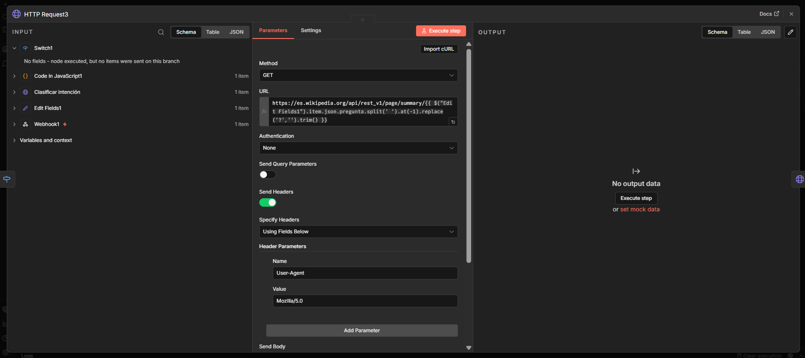
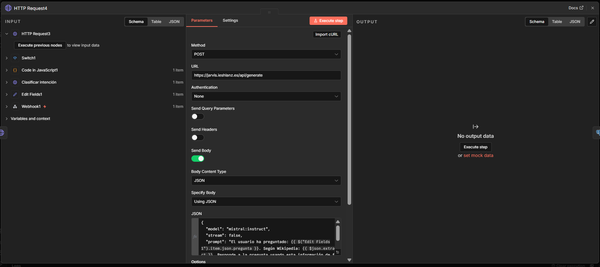
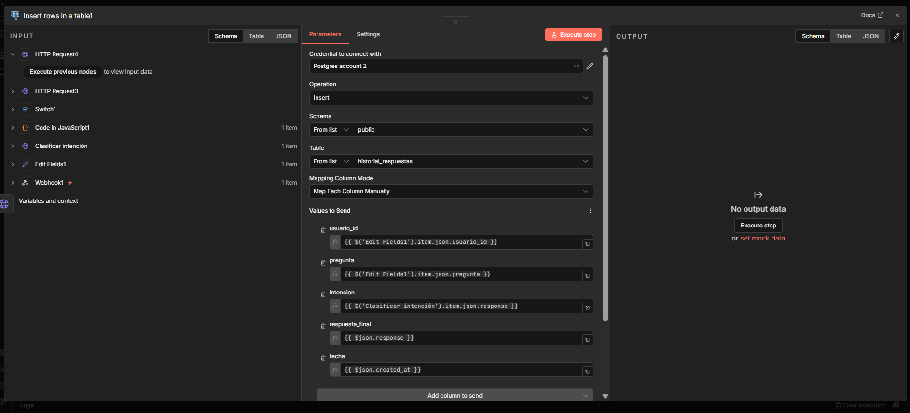

- Prompt Wikipedia
```json
{
    "model": "mistral:instruct",
    "stream": false,
    "prompt": "El usuario ha preguntado: \"{{ $("Edit Fields1").item.json.pregunta }}\". Según Wikipedia: \"{{ $json.extract }}\". Responde a la pregunta usando esta información de forma breve y amigable."
}
```


* **Generación Humana y Registro Final:** Cada rama, tras obtener los datos técnicos, pasa por un nodo de IA Traductora que redacta un mensaje amigable. Finalmente, cada rama termina en un nodo de PostgreSQL que guarda en `chatbot_db`:
    * `usuario_id`
    * `pregunta original`
    * `intencion detectada`
    * `respuesta_final de la IA`


- General: 
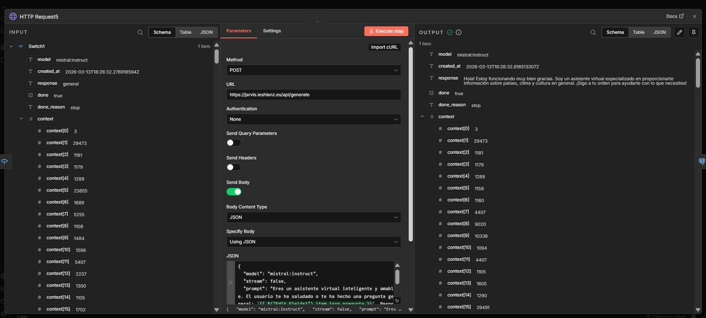
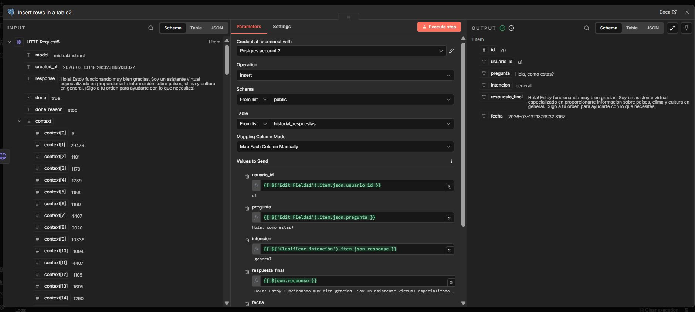

- General Prompt: 
```json
{
    "model": "mistral:instruct",
    "stream": false,
    "prompt": "Eres un asistente virtual inteligente y amable. El usuario te ha saludado o te ha hecho una pregunta general: '{{ $("Edit Fields1").item.json.pregunta }}'. Responde de forma natural y servicial. Si te preguntan quién eres, explica que puedes ayudar con información de países, el clima y cultura general."
}
```

* **Configuración de la Base de Datos(PostgreeSQL)**:
Para garantizar la conexión entre n8n y la base de datos dentro del entorno Docker, se aplicó la siguiente configuración técnica:
- Host: host.docker.internal (Permite la comunicación entre el contenedor n8n y el puerto 5432 del host Windows).
- Database: chatbot_db (Base de datos dedicada creada mediante CREATE DATABASE).
- Estructura de la tabla: 
```sql
CREATE TABLE historial_respuestas (
    id SERIAL PRIMARY KEY, -- Gestionado automáticamente por Postgres
    usuario_id TEXT,
    pregunta TEXT,
    intencion TEXT,
    respuesta_final TEXT,
    fecha TIMESTAMP DEFAULT CURRENT_TIMESTAMP
);
```


## Estructura del Workflow 
- Error de Clave Duplicada (id=0): Se detectó que enviar un ID manual causaba fallos. Se solucionó dejando que la base de datos gestione el autoincremento (SERIAL).
- Carga Infinita en Ejecución: Se corrigió el nombre del Host en las credenciales a host.docker.internal, permitiendo que n8n "encontrara" a Postgres fuera de su propio contenedor.
- Clasificación Imprecisa: Se optimizó el prompt de Mistral incluyendo ejemplos de entrenamiento (Few-Shot) para diferenciar claramente entre datos de países y cultura general.

